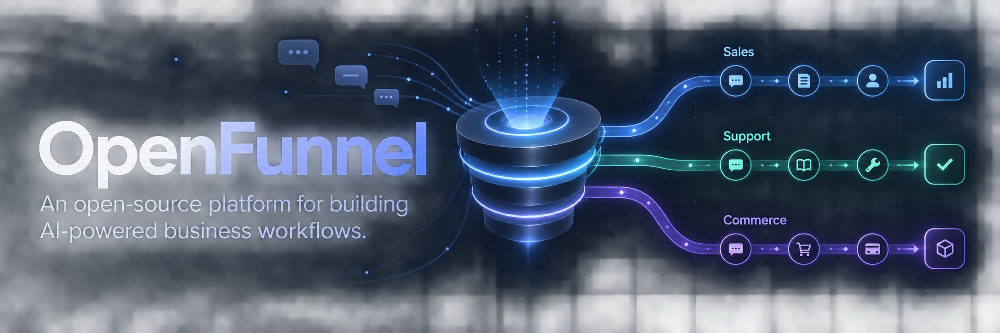

# openfunnel_kit

Proyecto en etapa inicial. Partimos con lo mínimo y añadiremos estructura y herramientas a medida que sean necesarias.

El [checklist reutilizable](docs/CHECKLIST-PROYECTO.md) describe el proceso desde la inicialización del repositorio hasta la publicación de una landing. Incluye prompts y puede copiarse a otro proyecto sin recursos adjuntos.

## Stack

- Frontend: React + Vite, JavaScript y CSS.
- Backend: Node.js con `node:http`.
- Base de datos: SQLite con `node:sqlite`, sin ORM.
- Un único `package.json`, npm y módulos ES.

Requiere Node.js 24.13 o superior. `.nvmrc` selecciona la rama 24. En Node 24.13, `node:sqlite` emite una advertencia experimental; el módulo funciona sin flags adicionales.

## Desarrollo local

Ejecutar los comandos desde la raíz del proyecto:

```sh
npm install
```

En una terminal, iniciar el backend:

```sh
npm run dev:backend
```

En otra terminal, iniciar el frontend:

```sh
npm run dev
```

Abrir http://localhost:5173. Vite redirige `/api` al backend en `http://127.0.0.1:3001`. La pantalla inicial comprueba `GET /api/health`, que ejecuta una consulta real en SQLite.

La configuración es opcional: copiar los valores de `.env.example` a `.env` para cambiar `PORT` o `DATABASE_PATH`. Las rutas de SQLite son relativas a la raíz. Reiniciar ambos servidores después de cambiar la configuración. No guardar secretos en variables `VITE_*`, porque se exponen al navegador.

SQLite se crea automáticamente en `backend/data/app.sqlite`; todavía no hay tablas de negocio. Los datos locales, `.env`, dependencias y archivos compilados quedan fuera de Git.

## Comandos y estructura

La landing definitiva está en **`landing/`**, basada en la propuesta v2. El HTML y CSS están en la raíz; las imágenes de producción se organizan en `landing/assets/images/`.

- `npm run dev:landing`: abre la landing en http://127.0.0.1:5174, independiente de la API.
- `npm run build:landing`: compila `landing/` en `dist/landing/`.
- `npm run preview:landing`: sirve la compilación en http://127.0.0.1:4174.
- `landing/`: HTML semántico, CSS responsive, cinco ilustraciones WebP transparentes en `assets/images/` y conectores SVG. Las etiquetas permanecen en HTML. El selector del encabezado alterna entre tema claro y oscuro; inicialmente sigue al sistema y guarda la elección en el navegador. Usar `npm run dev:landing` para disponer de esta interacción; abrir [landing/index.html](landing/index.html) directamente permite ver la página estática.
- `docs/CHECKLIST-PROYECTO.md`: guía reutilizable de trabajo. Los recursos de diseño temporales se eliminan; solo se conservan en la landing las imágenes optimizadas que utiliza.

- `npm run build`: compila el frontend en `frontend/dist/`.
- `npm run preview`: previsualiza la compilación; requiere el backend iniciado para `/api`.
- `npm start`: inicia solo la API, sin recarga automática.
- `frontend/src/`: interfaz React y estilos.
- `backend/`: servidor HTTP y conexión SQLite.

Esta base cubre desarrollo local. El despliegue y el servicio del frontend compilado se definirán cuando sean necesarios.

## Trabajo con GitHub

Repositorio: https://github.com/chrisenprod/openfunnel_kit

Usaremos siempre la cuenta de GitHub `chrisenprod` y GitHub CLI (`gh`) para autenticarnos, gestionar issues y pull requests y consultar el repositorio. Git se usa para los cambios locales y para `fetch`, `pull` y `push`, con la autenticación configurada mediante `gh`.

```sh
gh auth status
gh auth switch --hostname github.com --user chrisenprod
gh api user --jq .login # Debe devolver chrisenprod.
gh auth setup-git --hostname github.com
gh repo view
gh issue list
gh pr list
```

Si no hay una sesión de `chrisenprod`, ejecutar `gh auth login --hostname github.com --git-protocol https` con esa cuenta antes de continuar. No extraer ni inyectar tokens manualmente para cambiar de cuenta.

El remoto `origin` apunta a `https://github.com/chrisenprod/openfunnel_kit.git`.

Mantener el proyecto simple: añadir herramientas, dependencias y archivos solo cuando una necesidad concreta los justifique.
