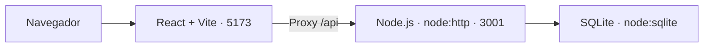

# OpenFunnel — arquitectura

Estado: base manual e integración Zernio/IA implementadas; recorrido real de respuestas pendiente de verificar.
Actualizado: 2026-09-23.

Leer junto con [el concepto](CONCEPTO.md), [el PRD](PRD.md) y
[el sistema de diseño](DESIGN_SYSTEM.md). El PRD define el alcance y este documento explica la implementación actual.
La evidencia de verificación está en [qa/PRIMERA-ETAPA.md](qa/PRIMERA-ETAPA.md).

## 1. Arquitectura actual

Una aplicación React, una API Node.js y una base SQLite. Un único `package.json`
y `package-lock.json` en la raíz; JavaScript con módulos ES. Requiere Node.js
24.13 o superior; `.nvmrc` selecciona la rama 24.



El diagrama describe desarrollo local. Vite no es el servidor de producción.

| Parte | Implementación actual |
|---|---|
| Interfaz | React: login, navegación por hash, temas, CRUD, bandeja y tickets por etapas. Componentes en `frontend/src/`. |
| API | `backend/server.js` usa `node:http`, escucha en `HOST` o `127.0.0.1` y usa `PORT` o 3001. Docker configura `HOST=0.0.0.0` sin publicar el puerto de API. |
| Salud | `GET /api/health` ejecuta `SELECT 1 AS ok` en SQLite; devuelve 200 con `ok: true` o 503 si falla la consulta. |
| API de negocio | CRUD `/api/<recurso>` y `/api/<recurso>/<id>`, autenticado mediante sesión. Rutas desconocidas devuelven 404. |
| Persistencia | `backend/db.js` abre la base con `node:sqlite`, activa WAL y claves foráneas. Aplica migraciones SQL versionadas, con claves foráneas e índices. |
| Configuración | `admin_user`, `admin_pass`, `APP_ORIGIN` y opciones de puerto/base/secreto en `.env.example`. Base predeterminada: `backend/data/app.sqlite`. |
| Autenticación | Better Auth 1.7.5 + username, tablas `auth_*` y acceso único. El directorio `users` no habilita login. |
| Especificaciones | OpenSpec 1.13.1 local; `openspec/config.yaml`, contratos vigentes en `openspec/specs/` y cambios en `openspec/changes/`. |

La API cierra el servidor y la conexión SQLite al recibir SIGINT o SIGTERM.
`npm start` inicia solo la API, no sirve la compilación React.

## 2. Aplicación y landing

Son entregables independientes:

- **App:** `frontend/` + `backend/`. `npm run build` genera `frontend/dist/`.
  `npm run dev` utiliza 5173 y redirige `/api` al backend. La previsualización
  del frontend también necesita la API para esas rutas.
- **Landing:** `landing/`, sin API ni SQLite. `npm run build:landing` genera
  `dist/landing/`; desarrollo en 5174 y previsualización en 4174.

El despliegue estático documentado de la landing no publica la app. La configuración
del VPS está en `deploy/openfunnel.nginx.conf`; los otros destinos y procedimientos
están en [la guía de despliegue](deploy/DESPLIEGUE-LANDING.md). Publicar únicamente
la compilación correspondiente, nunca el repositorio completo ni la base de datos.

La app dispone también de un `Dockerfile` con targets `web` (Nginx y frontend
compilado) y `api` (Node), coordinados por `compose.yaml`. Una única API/worker
usa el volumen persistente SQLite; solo web publica un puerto en loopback. La
configuración `DOCKER_*` está separada de desarrollo y ambos procesos corren sin root.
No se usa `vite preview` como servidor de producción. Procedimiento en
[DOCKER.md](deploy/DOCKER.md) y diseño en
[`containerize-app`](../openspec/changes/containerize-app/design.md).

La app está publicada en `app.openfunnel.mocca.cl`, con API en `/api` y HTTPS
terminado por Nginx del VPS. La release usa `compose.production.yaml`, red dedicada
y volumen externos, firewall previo a Docker y una única API. Operación y riesgos
pendientes en [PRODUCCION.md](deploy/PRODUCCION.md).

La verificación de app en GitHub está definida en `.github/workflows/ci.yml` para
main y PR, con pruebas sintéticas y sin secretos de producción. No despliega.
El entorno del VPS se provisiona fuera del checkout con permisos privados;
ver [CI y entorno](deploy/CI-Y-ENTORNO.md). La auditoría mantiene el riesgo de Ubuntu aplazado por decisión expresa del usuario;
la publicación no implica que el mantenimiento esté resuelto.

## 3. Primera etapa implementada

El [PRD](PRD.md) define acceso single user y CRUD sobre SQLite. No requiere cambiar
el stack ni añadir un framework de servidor, ORM, TypeScript o servicios separados.

Flujo de una operación:

1. La UI solicita un recurso a la API interna.
2. La API verifica la sesión del administrador para los datos de negocio.
3. El manejador valida entrada y reglas de relación.
4. SQLite ejecuta consultas parametrizadas; los cambios relacionados usan transacción.
5. La API devuelve el resultado o un error definido; la UI actualiza su estado.

`backend/server.js` gestiona HTTP y autorización; `backend/resources.js` valida y
persiste recursos; `shared/resources.js` comparte definiciones de campos con la UI.
No se aceptan identificadores SQL arbitrarios del cliente.

### Autenticación

`backend/auth.js` conecta Better Auth a DatabaseSync. El único administrador tiene
un ID estable; su username y hash se sincronizan desde `.env` al arrancar. Cambiar
usuario o contraseña elimina las sesiones anteriores; no crea otra identidad.

Solo se exponen `POST /api/login`, `GET /api/session` y `POST /api/logout`; no se
publica el handler general de Better Auth. La sesión viaja únicamente en cookie
HttpOnly/SameSite, Secure bajo HTTPS, y vence a las 8 horas sin renovación ni cache.
Las respuestas omiten tokens y hashes. El secreto de firma se genera y persiste en
`auth_settings` cuando falta `BETTER_AUTH_SECRET`.

Las mutaciones requieren `Origin` igual a `APP_ORIGIN`; no se confía en encabezados
forwarded para elegirlo. El login limita a diez intentos por minuto por instancia.
Sin credenciales, salud sigue disponible y el resto devuelve 503. Credenciales
mal formadas hacen fallar el arranque con un mensaje sin valores secretos.

### Datos

Entidades persistidas: users, contactos, canales, conversaciones, mensajes, agentes
IA, prompts, tools, pipelines, stages y tickets. `pipeline_stages` pertenece a un
pipeline; un ticket ocupa una etapa válida de ese pipeline. El PRD contiene campos,
asociaciones y reglas; no duplicar aquí un segundo esquema que pueda divergir.

`backend/migrate.js` aplica por orden los SQL de `backend/migrations/` dentro de
transacciones y registra sus nombres en `schema_migrations`. No modificar migraciones
ya aplicadas. La 001 contiene el dominio y la 002 el esquema generado con Better Auth
1.7.5, más el secreto de sesión. Nuevas funciones requieren nuevas migraciones.

Pipelines guardan sus etapas de forma atómica con IDs estables; agentes guardan
`prompt_ids` ordenados y `tool_ids` únicos. FK compuestas protegen etapa/pipeline y
conversación/contacto del ticket. Los borrados con referencias se rechazan con 409.
La API valida campos, estados, longitudes, JSON y nuevas asignaciones a inactivos.

GET de colección admite `q`, `page` y `pageSize` (25 por defecto, máximo 100), además
de filtros definidos por recurso. Devuelve `{items,total,page,pageSize}`. Conversaciones
incluye `channel_kind` derivado del canal local para iconos de plataforma en lista y detalle. GET de
registro, POST y PATCH devuelven el registro; DELETE devuelve `{ok:true}`. Los errores
usan `{error,fields?}` con 400, 401, 403, 404, 409, 413, 415, 429 o 503 según el caso.
Las colecciones son users, contacts, channels, conversations, messages, ai_agents,
prompts, tools, pipelines, pipeline_stages y tickets. Las asociaciones se editan
junto al agente y las etapas junto al pipeline, sin CRUD genérico para tablas de auth.

### Interfaz

Implementada en React y CSS siguiendo [DESIGN_SYSTEM.md](DESIGN_SYSTEM.md). La app comparte
campos y patrones, con vistas específicas para relaciones, mensajes y etapas. La identidad
visual no exige importar los estilos completos de la landing ni una biblioteca UI.

El shell conserva la preferencia de sidebar compacto en localStorage, con anchos
de 232/88 px en escritorio. `frontend/src/icons.jsx` contiene los SVG de navegación;
el menú móvil mantiene iconos y etiquetas completas. Prompts y Tools se administran
desde la navegación interna de Agentes IA; mantienen sus rutas y endpoints, y la
entrada Agentes IA permanece activa al abrir sus listados, detalles o formularios. Las tarjetas Kanban usan
controles compactos con ratón y áreas de 44 px con puntero táctil.

`frontend/src/kanban.jsx` comparte el tablero entre el detalle de Pipelines y la
vista por etapas de Tickets. Usa Pointer Events con un asa táctil y un selector
accesible. Cada movimiento persiste `stage_id` mediante PATCH de tickets; no cambia
su estado ni añade orden manual. Las columnas se consultan de nuevo después de
guardar o ante fallo para reconciliar el estado. No requiere nuevas tablas ni librerías.

## 4. Canales y ejecución de agentes

El cambio `connected-conversations` implementa la [segunda etapa del PRD](PRD.md#10-segunda-etapa-canales-conectados-y-agentes-en-conversaciones).
La configuración y operación están en [la guía de integraciones](deploy/INTEGRACIONES.md).

- `backend/zernio.js` traduce y valida cuentas, conversaciones y mensajes; usa fetch
  con host fijo y errores depurados. La UI consume entidades locales.
- `backend/integration-store.js` conserva identidad externa/local, contexto y pausas.
  Las migraciones 003/004 amplían el esquema sin alterar registros manuales.
- `backend/integrations.js` gestiona autorización, nonce ligado a sesión, webhook HMAC,
  sincronización paginada, worker, runs y outbox persistidos en SQLite. Un proceso por base.
- `backend/llm.js` utiliza el SDK oficial OpenAI con `LLM_BASE_URL`, `LLM_API_KEY` y
  `LLM_MODEL`; valida Chat Completions/tool calling y limita funciones a contexto actual.
- `frontend/src/integrations.jsx` añade conexión/sync, validación de modelo, asignación
  de agente, control humano, envío y actividad dentro de los módulos existentes.

Los endpoints `/api/integrations`, perfiles, sync, conexión y registro de webhook
requieren sesión; el callback verifica sesión/nonce y redirige a una URL limpia.
`POST /api/integrations/zernio/webhook` utiliza HMAC, sin cookie. Las acciones de
canal/conversación/agente conservan protección de origen. Las credenciales nunca
se entregan al frontend. Los mensajes remotos no admiten el CRUD manual de contenido.

Las tools ejecutables son `get_contact`, `get_ticket` y `handoff_to_human`. El catálogo
se sincroniza con IDs `builtin_*` al abrir cada base de negocio mediante
`backend/native-tools.js`. GET es público autenticado; sus definiciones no tienen
CRUD en UI/API. Se conservan referencias heredadas y la selección explícita por agente.
No ejecuta código ni URLs arbitrarias. La cola separa generación de envío, invalida respuestas
obsoletas y deja resultados ambiguos pendientes de revisión, sin reenvío automático.

No están incluidos MCP, RAG, campañas, comentarios,
plantillas, multitenancy ni microservicios. La implementación se verifica con proveedores
simulados; el estado de pruebas reales está en [QA](qa/INTEGRACIONES.md).

### Herramientas mínimas de agentes (cuarta etapa)

Implementadas en desarrollo mediante `agent-workbench`, sin despliegue. Migración
005 aditiva: `api_keys`, `prompt_versions`, `prompts.version` y
`ai_agents.business_context` (legacy). Migración 006 convierte ese contexto en TXT y
añade `agent_documents`: original BLOB, texto extraído, metadata, estado y revisión.
Las claves guardan hash de un secreto aleatorio y
permisos explícitos. `backend/api-keys.js` autentica Bearer; el servidor permite solo
lectura, creación/edición/restauración de prompts, creación/configuración de agentes,
asignación de canal con IA desactivada y pruebas según scope. `agents:write` y
`channels:assign` no se conceden automáticamente a claves antiguas. PUT
`/api/channels/:id/agent` solo admite `agent_id`, reutiliza la configuración de
automatización con `enabled:false` y nunca llama al proveedor. Sesiones conservan
Origin y no se mezclan con Bearer. Gestión de claves reservada al administrador.

`resources.js` guarda versiones de prompts con autor dentro de la transacción y
exige `expected_version`. `backend/agent-workbench.js` pagina/restaura versiones y
prueba agentes con todas las tools simuladas, sin escribir mensajes ni runs operativos.
`agentMessages` comparte instrucciones y contexto textual entre pruebas y runtime;
los cambios entran en el hash de configuración que se revalida antes de enviar.
No hay almacenamiento de pruebas ni nueva cola. Los límites por identidad son locales
al proceso; una sola prueba concurrente y cancelación de la llamada al vencer 60s.

`backend/documents.js` coordina carga binaria, cuotas (5 MiB/10 documentos/30000
caracteres), revisiones y descargas autenticadas. Extracción en un worker thread
con `word-extractor` para DOC/DOCX y `pdfjs-dist` para PDF; TXT/MD UTF-8 nativo.
Timeout 15s y heap V8 128 MiB, una extracción simultánea. No OCR ni archivos en disco;
reemplazo atómico tras validar y extraer, conservando el anterior ante errores.
Una carga nueva fallida conserva original y error. Al arrancar, processing interrumpido
pasa a error. El texto de documentos ready se incluye en cada inferencia y en configHash.

El modelo proviene exclusivamente de LLM_MODEL, con endpoint/clave del entorno;
se ignoran provider/model legacy y se rechazan como campos editables por API.
Las pruebas aceptan historial temporal alternado user/assistant y context_hash de
la respuesta anterior para detectar cambios; no persisten el chat.

La UI incorpora Claves API, historial en Prompts y Instrucciones/Herramientas/Contexto/Probar
dentro del agente. `scripts/build-docs.js` compila una lista explícita de Markdown
público usando marked (dev), produce dist/docs y copias para app/landing /docs/.
No se publican archivos privados ni todo el árbol docs; sirve sin backend o sesión.
Contrato, límites, retención y ejemplos en [API para agentes](api/AGENTES.md).

## 5. Organización y verificación

La raíz de `docs/` contiene solo estos cuatro documentos:

```text
docs/
├── CONCEPTO.md
├── PRD.md
├── DESIGN_SYSTEM.md
├── ARCHITECTURE.md
├── checklists/
├── deploy/
├── qa/
└── referencias-visuales/   # Local, ignorado por Git
```

Los checklists son plantillas reutilizables. Las instrucciones para agentes siguen
en `AGENTS.md`, y README, licencias y configuración permanecen en la raíz del repositorio.
Los archivos ejecutables de despliegue continúan en `deploy/`; `docs/deploy/` contiene
su documentación. Los antecedentes visuales locales no son necesarios para un clon.

Ejecutar comandos desde la raíz: `npm ci` para reproducir dependencias,
`npm run dev:backend` y `npm run dev` en terminales separadas. Al implementar cambios,
comprobar `npm test`, `npm run build`, los endpoints afectados y `npm run spec:validate`.
Para la landing, comprobar también su compilación y comportamiento visual cuando se modifique.

No versionar secretos, bases SQLite, dependencias o compilaciones. Conservar la
separación de licencias de núcleo, landing e identidad descrita en
[LICENSING.md](../LICENSING.md).

## 6. Operación local y límites

Un proceso de API administra una instalación. El límite de login reside en memoria
y se reinicia con el proceso. No se promete edición colaborativa: el último guardado
válido prevalece. Los catálogos de selectores cargan todas sus páginas; deberá
evaluarse búsqueda incremental si el volumen de datos lo requiere.

Respaldar SQLite con el servidor detenido, copiando el archivo de la base después
del cierre limpio de WAL, o mediante la API de backup de SQLite mientras esté activo.
No copiar solo el archivo principal durante escrituras. Restaurar una copia compatible
antes de volver a una versión previa del esquema; no hay migraciones destructivas de
rollback automáticas. Los backups contienen datos de negocio y hashes/secretos de auth,
por lo que permanecen fuera del directorio público y de Git.

El despliegue automático Publicar VPS se define en `deploy-app.yml`, separado del CI.
App y landing son destinos habilitables por instalación y se publican solo cuando
cambian sus entradas. La landing usa configuración externa y archivos estáticos
sin reiniciar servicios; ver [LANDING-VPS-ACTIONS.md](deploy/LANDING-VPS-ACTIONS.md). Solo
publica main verificado mediante una cuenta SSH con comando forzado y validación
independiente del CI en el VPS. Una unidad systemd mantiene el trabajo independiente
de SSH; el lock del host y Actions serializan. Backup, guard de migraciones y
rollback de código preservan el volumen existente. Detalles y límites en
[CI-Y-ENTORNO.md](deploy/CI-Y-ENTORNO.md).

## 10. Cuentas cloud y conexiones propias

Implementación local en `cloud-accounts-and-provider-keys`, activada únicamente
con `APP_MODE=cloud`. El modo predeterminado conserva single user. La facturación se habilita por separado.

`backend/cloud-server.js` despacha autenticación y administración sobre
`CLOUD_DATA_DIR/control.sqlite`; Better Auth usa correo/contraseña y Resend para
verificación y recuperación. Los únicos endpoints de autenticación expuestos son
login/logout/session y register/resend/recover/verify/reset explícitos, no el handler
completo de Better Auth. Tokens con caducidad y hash de uso único, límites
persistidos y propietario verificado según `CLOUD_OWNER_EMAIL`.

Cada cuenta verificada tiene un UUID de espacio, una SQLite en `workspaces/` y su
worker dentro del mismo proceso. Se reutilizan los controladores de negocio sin
exponer servidores internos. La sesión decide el espacio; Bearer exige
`X-OpenFunnel-Workspace` y la clave se autentica dentro de esa base. Callbacks y
webhooks incluyen el UUID en la ruta; sus firmas derivan de la clave maestra y el
espacio. Suspensión se comprueba también antes y después de llamadas externas.
No se ofrece acceso del superadmin al contenido de cuentas ajenas.

`provider-connections.js` cifra conexiones con AES-256-GCM, nonce aleatorio y AAD
espacio/proveedor/versión. La clave maestra externa se configura mediante
`PROVIDER_ENCRYPTION_KEY`. Self-hosted prioriza entorno, cloud exige claves propias.
El SDK LLM resuelve la configuración actual e invalida resultados tras rotación;
la mutación de conexiones pausa automatización y cancela salidas pendientes.
`provider-network.js` exige HTTPS/443 y hosts autorizados, rechaza redirecciones y
valida todas las direcciones DNS en la conexión real del socket.

La migración 007 añade conexiones, cuentas, tokens de correo, límites y auditoría.
`scripts/migrate-cloud-owner.js` trabaja offline sobre una copia y un dueño ya
verificado; no sobrescribe destinos ni elimina la fuente. Guía pública, recuperación
y límites en [Cuentas y conexiones](site/cuentas.md). Respaldo del control y todas
las bases como un conjunto, con secretos externos por separado. Un proceso por
instancia; no escalar réplicas compartiendo SQLite.

## Facturación cloud opcional

`BILLING_ENABLED=true` habilita suscripciones y créditos con Polar en cloud.
Configuración y operación en [la guía de facturación](site/facturacion.md).
API Polar desde backend y verificación con `standardwebhooks`; sin SDK frontend.
`backend/billing.js` conserva planes, períodos y operaciones en SQLite de control;
`backend/polar.js` encapsula el proveedor. No activar cobros ni usar tarjetas reales
en QA: usar sandbox o transportes simulados. Un solo worker por SQLite.

### Exención opcional del dueño

`BILLING_OWNER_EXEMPT` se verifica dentro del medidor consultando rol superadmin,
estado activo y correo verificado del espacio. La migración 010 añade
`billing_exempt_operations`, con las mismas reservas y recuperación que el ledger
pagado. Historial une ambos; `owner_exempt` y `exempt_usage` describen acceso y uso
sin simular un saldo ilimitado numérico. No altera períodos ni eventos Polar.

### Preparación automática al guardar proveedores

`backend/provider-setup.js` coordina guardado cifrado y validación IA/registro webhook,
con estado derivado del runtime y errores/versiones en `integration_settings`. Un
fallo externo no revierte el guardado: metadata devuelve `setup.status=failed`.
POST de conexión reintenta con sesión, Origin y expected_version; un bloqueo por
proveedor evita escrituras concurrentes. Se conservan checks de rotación y suspensión.
La invalidación de conexiones solo borra la preparación del proveedor cambiado;
la suspensión invalida ambas. No hay efectos externos en GET o reinicio.


### Edición directa y primer uso

GET/PUT `/api/ai_agents/:id/instructions` conserva asociaciones y orden, devuelve
agentes afectados y guarda contenidos con versiones optimistas en una sola transacción.
La primera edición crea y asocia un prompt; un conflicto revierte el conjunto. Sesión
exige Origin; Bearer requiere resources:read para lectura y agents:write más
prompts:write para guardado. No cambia herramientas ni estado del canal.

GET `/api/setup` es lectura local con sesión del espacio; deriva conexión IA/canal,
agente preparado y prueba guardada exitosa. El logro (sin mensajes) se conserva en
integration_settings con prefijo onboarding_test. `attention=needed` filtra conversaciones
abiertas manuales o con outbound fallido/incierto, con paginación en servidor.
