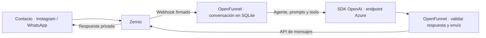

# OpenFunnel — PRD de la plataforma

Estado: primera etapa manual implementada mediante el cambio OpenSpec
`platform-foundation`; segunda etapa de canales e IA implementada en código mediante `connected-conversations`,
con pruebas reales de respuestas todavía pendientes.
Las secciones 1–9 conservan la base manual; la sección 10 define su evolución.
La sección 11 planifica la tercera etapa de infraestructura y producción.
La sección 12 recoge la preparación para operar agentes externos mediante
API, documentos de conocimiento, versiones de prompts, pruebas aisladas y docs públicas. Implementada en
desarrollo mediante `agent-workbench`, sin despliegue; no cierra los pendientes de verificación y operación anteriores.
La arquitectura y la evidencia de QA describen la implementación verificada.
La sección 14 define la cuarta etapa, microSaaS, todavía en implementación: cuentas con
Better Auth, verificación mediante Resend y conexiones con claves propias desde
la interfaz. El modelo de cobro queda pendiente entre suscripción y créditos.

Actualizado: 2026-09-25. Fuente: [CONCEPTO.md](CONCEPTO.md) y alcance acordado por etapas.

## 1. Objetivo

Construir una plataforma privada donde un administrador pueda organizar contactos,
conversaciones y tickets, definir pipelines y preparar la configuración de agentes
de IA. Esta primera etapa entrega autenticación, persistencia SQLite y CRUD desde
una interfaz minimalista y profesional basada en la identidad de la landing.

El resultado debe poder utilizarse con registros manuales, sin contratar ni conectar
servicios externos. La segunda etapa conecta Instagram y WhatsApp mediante Zernio
y ejecuta agentes con una API compatible con OpenAI, usando Azure en esta instalación.
La preparación de agentes abre operaciones autorizadas a otras aplicaciones mediante API keys
y añade documentos del negocio, versiones de prompts, pruebas aisladas y documentación pública. MCP queda para después.

La dirección de producto sigue siendo el motor conversacional de `CONCEPTO.md`.
Este PRD delimita la base manual, el recorrido con mensajes reales e IA, su operación
en producción y la siguiente entrega de acceso programático y mejora de agentes.
No es el checklist reutilizable: ese documento registra el proceso general para
cualquier proyecto; aquí se define lo que se construirá en OpenFunnel.

## 2. Alcance y vocabulario

| Elemento | Qué representa en esta etapa |
|---|---|
| Administrador | Única identidad que puede iniciar sesión, configurada en `.env`. |
| Usuario | Persona del directorio interno, asignable como responsable. Crear un usuario no habilita un nuevo acceso. |
| Contacto | Interlocutor externo, cliente o prospecto. |
| Canal | Registro del medio por el que se recibe o atiende una conversación; todavía sin conexión externa. |
| Conversación | Intercambio con un contacto, que contiene mensajes. |
| Mensaje | Registro de texto de una conversación. Guardarlo no lo envía a un canal. |
| Ticket | Unidad de trabajo o caso que se gestiona, vinculable a una conversación y un contacto. |
| Pipeline | Recorrido ordenado de etapas para gestionar tickets. |
| Agente IA | Configuración de un agente, sus instrucciones y herramientas; todavía no ejecuta un modelo. |
| Prompt | Instrucciones reutilizables que pueden asociarse a un agente. |
| Tool | Definición de una herramienta que podrá usar un agente; todavía no ejecuta acciones. |

**Tickets sustituye a deals en esta base.** Un deal tiene significado comercial;
el ticket es un caso general que puede servir después para Sales, Support u otros
recorridos. No se crean ambas entidades ni módulos de cotizaciones, ingresos, SLA
o resolución de soporte especializada.

El pipeline contiene etapas; el ticket ocupa una etapa. La conversación conserva
los mensajes y se vincula al ticket. La etapa se guarda en el ticket, sin duplicarla
en la conversación. Esto concreta el seguimiento de trabajo descrito en el concepto.

### Incluido

- Login y logout de un único administrador mediante `admin_user` y `admin_pass`.
- CRUD de users, canales, conversaciones, mensajes, agentes IA, prompts, tools,
  pipelines, contactos y tickets.
- Etapas de pipeline y asociaciones entre agentes, prompts y tools.
- Listados, búsqueda, filtros básicos, formularios y vistas de detalle relacionadas.
- Vista de tickets por etapas, además del listado.
- Validación en servidor, relaciones consistentes, persistencia y estados de interfaz.

### Fuera de la primera etapa manual

La sección 10 incorpora parte de estas capacidades a la segunda etapa; esta lista
describe únicamente los límites de la base manual.

- Registro público, invitaciones, varios usuarios con acceso, roles y permisos configurables.
- Organizaciones, workspaces, aislamiento entre clientes y oferta cloud.
- API keys para consumidores externos y servidor MCP.
- Conexión con Zernio, recepción de webhooks, sincronización y envío real por canales.
- OpenAI API u otros proveedores, ejecución de agentes y ejecución de tools.
- Motor automático de transiciones, aprobaciones y traspaso entre IA y personas.
- Adjuntos, audio, búsquedas semánticas, RAG y bases de conocimiento.
- Facturación, medición de tokens, campañas, automatizaciones y analítica comercial.

La API interna que usa la UI sí es necesaria en esta etapa. Posponer API keys no
significa posponer los endpoints del CRUD.

## 3. Acceso del administrador

### Requisitos

- Las variables de servidor se llaman exactamente `admin_user` y `admin_pass`.
  El login solicita usuario y contraseña; no presupone que el usuario sea un email.
- Ambas variables son obligatorias para habilitar el acceso. Si faltan, no se habilita
  un administrador predeterminado ni acceso anónimo a los datos.
- Better Auth ya está instalado y es la base prevista para gestionar la autenticación.
  Su integración con usuario/contraseña, `node:http` y `node:sqlite` se concretará
  en el diseño OpenSpec, sin añadir un framework de servidor ni cambiar el stack.
- Las credenciales proceden de `.env` y no se editan desde el CRUD de usuarios.
  Si la integración necesita persistir una credencial, almacena únicamente un hash.
- El administrador puede iniciar sesión, recargar la aplicación conservando una
  sesión válida y cerrar sesión. Una sesión vencida requiere iniciar sesión otra vez.
- Proteger los endpoints de negocio en el servidor, además de las rutas de la UI.
  `GET /api/health` conserva su contrato de comprobación de salud.
- Usar una sesión con vencimiento, cookie HttpOnly y Secure bajo HTTPS; definir
  protección de las operaciones con cookie frente a solicitudes de otros orígenes.
  Limitar intentos de login y devolver un error genérico ante credenciales incorrectas.
- No enviar contraseñas, hashes ni tokens de sesión en listados, respuestas de error
  o logs. Nunca usar variables `VITE_*` para estas credenciales.
- Cambiar las credenciales en `.env` requiere reiniciar el backend e invalidar las
  sesiones anteriores. No crear un segundo administrador al cambiar `admin_user`.

### Relación con users

Propuesta para mantener el alcance single user: `users` es un directorio de personas
para asignación y referencia. Sus registros no tienen contraseña ni pueden iniciar
sesión. La identidad de acceso del administrador se distingue de ese directorio;
las tablas internas que necesite Better Auth se concretan durante el diseño técnico.

No se añaden registro, recuperación por email ni edición de credenciales en la UI.
La administración de `.env` queda fuera del panel.

## 4. Modelo de datos propuesto

Este es el esquema lógico que deben cubrir las especificaciones y las futuras
migraciones. No se crean tablas como parte de la redacción de este PRD.

Cada entidad principal tiene `id`, `created_at` y `updated_at`. Las referencias se
protegen con claves foráneas. Los campos obligatorios se validan en servidor; los
opcionales admiten ausencia explícita. Los nombres técnicos son una propuesta para
el diseño, mientras que los conceptos y relaciones describen el comportamiento esperado.

| Entidad / tabla | Campos mínimos además de los comunes | Relaciones y reglas principales |
|---|---|---|
| `users` | `name` obligatorio; `email` opcional; `active` | Personas internas. Si se proporciona email, validar formato y evitar duplicados normalizados. No contiene credenciales. |
| `contacts` | `name` obligatorio; `email`, `phone`, `company`, `notes` opcionales | Un contacto puede tener varias conversaciones y tickets. No imponer unicidad global a email/teléfono; pueden ser compartidos. |
| `channels` | `name`, `kind` obligatorios; `description`, `external_reference` opcionales; `active` | `kind` describe el medio, por ejemplo manual, WhatsApp o email. Todos aparecen como «Sin integración» en esta etapa. No almacenar tokens ni validar conexiones. |
| `conversations` | `title`, `contact_id`, `channel_id` obligatorios; `assigned_user_id` y `ai_agent_id` opcionales; `status` | Estado `open` o `closed`. Una conversación tiene muchos mensajes y, como propuesta inicial, como máximo un ticket. Asignar un agente no lo ejecuta. |
| `messages` | `conversation_id`, `body`, `direction`, `occurred_at` obligatorios | Solo texto; dirección `incoming` o `outgoing`. Todos son registros manuales. Orden estable por fecha y un desempate por ID. |
| `ai_agents` | `name` obligatorio; `description`, `provider`, `model` opcionales; `active` | Configuración editable. Prompts y tools mediante asociaciones. Provider/model son datos de preparación, sin llamadas ni claves. |
| `prompts` | `name`, `content` obligatorios; `description` opcional; `active` | Texto reutilizable; sin editor de plantillas ni motor de variables en esta etapa. |
| `tools` | `name`, `description`, `kind` obligatorios; `input_schema` opcional; `active` | Catálogo de definiciones. `kind` es una etiqueta de clasificación. Si se incluye un esquema de entrada, debe ser un objeto JSON válido; no implica ejecución ni soporte de un proveedor. |
| `pipelines` | `name` obligatorio; `description` opcional; `active` | Contiene etapas ordenadas. No necesita editor visual de nodos ni reglas automáticas. |
| `pipeline_stages` | `pipeline_id`, `name`, `position` obligatorios; `description` opcional | Nombres y posiciones únicos dentro del pipeline. Reordenar etapas es una operación atómica. |
| `tickets` | `title`, `contact_id`, `pipeline_id`, `stage_id` obligatorios; `description`, `conversation_id`, `assigned_user_id` opcionales; `status` | Caso general. Estado `open` o `closed`, separado de la etapa. La etapa pertenece al pipeline seleccionado. |

### Tablas de relación y soporte

- `agent_prompts`: `ai_agent_id`, `prompt_id`, `position`; permite ordenar las
  instrucciones de un agente, sin repetir la misma asociación.
- `agent_tools`: `ai_agent_id`, `tool_id`; cada asociación es única.
- Tablas de autenticación y sesiones que justifique la integración con Better Auth;
  no se exponen como CRUD genérico.
- Registro de migraciones para aplicar cambios de esquema sin recrear la base.

Estas piezas completan la lista inicial sin añadir módulos de producto. Runs,
deliveries, credenciales de proveedores y consumo se diseñarán cuando se implementen
las integraciones que los necesitan.

### Relaciones y decisiones de simplicidad

- Un ticket puede crearse directamente para un contacto o desde una conversación.
  Si tiene conversación, ambos deben pertenecer al mismo contacto.
- Propuesta inicial: una conversación se vincula como máximo a un ticket. Un ticket
  se vincula como máximo a una conversación. Agrupar conversaciones o dividirlas en
  varios casos queda pendiente hasta que un caso de uso lo justifique.
- Un contacto puede tener varios tickets independientes. Cerrar un ticket no cierra
  automáticamente la conversación, y cerrar la conversación no cierra el ticket.
- Un ticket puede cambiar manualmente de etapa. Si cambia de pipeline debe elegirse
  una etapa válida del nuevo pipeline en la misma operación.
- El responsable del ticket y el de la conversación son campos independientes.
  Crear el ticket desde una conversación puede proponer su responsable actual, sin
  mantener una sincronización automática posterior.
- Para esta entrega no se configura un agente por etapa. La asignación del agente
  a la conversación permite preparar el vínculo con la futura ejecución.
- Los datos desactivados conservan sus vínculos existentes y dejan de ofrecerse
  para nuevas asignaciones. No se pueden desactivar registros de forma que se
  pierda la lectura de conversaciones o tickets ya creados.

## 5. Requisitos del CRUD

Todos los módulos deben permitir crear, listar, consultar detalle, editar y solicitar
eliminación. Las restricciones de integridad son parte del CRUD, no errores ocultos.

| Módulo | Interacción mínima |
|---|---|
| Usuarios | Lista de personas, nombre/email y estado; alta, edición y desactivación. Informar que estos registros no habilitan acceso. |
| Contactos | Lista con búsqueda por nombre/email/teléfono; detalle con datos, conversaciones y tickets relacionados. |
| Canales | Lista por tipo y estado; formulario de metadatos y conversaciones relacionadas. Etiqueta visible «Sin integración». |
| Conversaciones | Bandeja filtrable por contacto, canal, responsable y estado; detalle con mensajes y enlace al ticket. |
| Mensajes | CRUD dentro del detalle de conversación. Acción «Registrar mensaje»; editar texto, dirección y fecha, y eliminar con confirmación. No mostrar «Enviar» ni estados entregado/leído. |
| Agentes IA | Lista y formulario; seleccionar prompts ordenados y tools habilitadas. Etiqueta «Configuración; ejecución pendiente». |
| Prompts | Lista, nombre, descripción y editor de texto simple; mostrar agentes que lo utilizan antes de modificarlo. |
| Tools | Lista y formulario de definición; mostrar agentes asociados. Sin botón de ejecutar o probar conexión. |
| Pipelines | Crear y editar pipeline, gestionar y reordenar sus etapas; consultar tickets por etapa. |
| Tickets | Lista con filtros por contacto, responsable, estado y pipeline; detalle editable y vista por etapas. Crear también desde una conversación. |

### Comportamientos compartidos

- Buscar, filtrar y paginar listados desde el servidor; conservar la selección al
  volver de un detalle. Proponer 25 registros por página como valor inicial.
- Conversaciones ofrece una bandeja unificada con «Todos los canales» y selección
  de un canal individual, incluidos inactivos para consultar historial. El selector
  está en listado y detalle; conserva búsqueda y filtros y reinicia la página al
  cambiar de canal. Los enlaces de detalle conservan la consulta al recargar y volver.
- Selectores cerrados y referencias con componente controlado de la app, búsqueda y teclado. Presentación compacta e iconos de plataforma/contexto junto a etiquetas.
- Formularios con etiquetas, campos obligatorios visibles y errores junto al campo.
  Guardar muestra resultado; un fallo conserva los valores introducidos.
- Impedir envíos repetidos mientras una operación está en curso. Mostrar estados
  de carga, lista vacía, ausencia de resultados y error recuperable.
- Una entidad recién creada aparece en listados y selectores relacionados sin
  necesitar recargar toda la aplicación. Los cambios persisten al reiniciar el backend.
- El servidor valida longitudes, tipos, estados y relaciones; la validación de la UI
  no es suficiente. Definir límites concretos de texto y paginación en las specs.
- Los campos de texto, mensajes y prompts se presentan como texto, sin ejecutar HTML.

### Eliminación e integridad

- Confirmar la eliminación identificando el registro y sus consecuencias.
- Bloquear con explicación la eliminación de contactos, canales, usuarios, agentes,
  prompts, tools, pipelines o etapas que sigan referenciados. Ofrecer quitar la
  asociación, reasignar o desactivar cuando esa entidad lo permita.
- No eliminar etapas con tickets. No permitir que un pipeline utilizable quede sin
  etapas; al crear un pipeline debe crearse al menos una etapa en la misma operación.
- No eliminar una conversación con mensajes o ticket vinculado. El administrador
  puede borrar sus mensajes y desvincular/eliminar su ticket explícitamente primero.
- Eliminar un mensaje no elimina la conversación. Eliminar un ticket no elimina su
  contacto ni conversación. No hay borrados en cascada silenciosos de datos de negocio.
- Cambiar el contacto de una conversación con ticket debe bloquearse hasta resolver
  el vínculo, evitando que el ticket apunte a un contacto diferente.

## 6. Experiencia y dirección visual

Guía de implementación visual: [sistema de diseño de la app](DESIGN_SYSTEM.md),
derivado de la dirección Campo de tinta de la landing. Adaptar su identidad a una herramienta de trabajo:
tipografía regular, azul tinta, espacio en blanco, divisores finos y jerarquía clara.
La UI se construye en `frontend/`, respetando los permisos de marca y recursos.

### Navegación

- **Operación:** Conversaciones, Tickets, Contactos.
- **Configuración:** Canales, Pipelines, Agentes IA, Usuarios.
- Dentro de **Agentes IA:** Agentes, Prompts y Tools como navegación interna.
  Prompts y Tools conservan sus catálogos compartidos y CRUD; no aparecen en el sidebar.
- Encabezado discreto con nombre de sección, tema y cierre de sesión.
- Pantalla inicial: bandeja de conversaciones con un estado vacío útil. No hace
  falta un dashboard de métricas para empezar.
- Mensajes dentro de la conversación y etapas dentro del pipeline, sin añadir
  secciones de navegación para tablas auxiliares.

### Sistema visual

| Elemento | Dirección |
|---|---|
| Tipografía | Helvetica Neue, Helvetica, Arial, sans-serif; pesos regulares y medios. Títulos de aplicación contenidos, sin tamaños de hero. |
| Tema claro | Fondo `#faf9f6`, superficie `#f0f1f1`, texto `#152842`, acento `#2349a0`. |
| Tema oscuro | Fondo `#0c1626`, superficie `#121f32`, texto `#edf1f8`, acento `#b5c3ff`. |
| Componentes | Botones sobrios, bordes finos, radios pequeños, tablas legibles y formularios consistentes. |
| Jerarquía | Una acción primaria por vista; acciones secundarias discretas y eliminación separada de guardar. |
| Decoración | Sin halos, gráficos ornamentales ni acuarelas detrás de tablas. El login puede usar un acento de marca sobrio. |
| Tema | Seguir preferencia del sistema inicialmente y conservar la selección del usuario. |

Cada pipeline se abre como tablero Kanban con sus etapas ordenadas y sus tickets.
Se puede mover una tarjeta entre etapas arrastrando su asa con ratón o pantalla
táctil, o utilizando un selector accesible. El movimiento se guarda en la API;
el estado abierto/cerrado sigue siendo independiente de la etapa. Ante un fallo,
mostrar el error y consultar la ubicación actual antes de reintentar. La vista
por etapas de Tickets ofrece los mismos controles. Listado y tablero consultan
los mismos registros. No se ordenan tarjetas manualmente dentro de una etapa.

En móvil, la navegación se contrae y los formularios mantienen etiquetas y acciones
visibles. Las tablas pueden tener desplazamiento horizontal dentro de su contenedor,
sin desbordar la página. Verificar al menos 390, 768 y 1440 px, navegación por teclado,
foco visible, contraste, mensajes de error y preferencia de movimiento reducido.

## 7. Condiciones técnicas

- Mantener React + Vite, JavaScript/CSS, Node.js con `node:http`, SQLite mediante
  `node:sqlite`, módulos ES y un único `package.json`/lockfile.
- Definir migraciones SQL pequeñas y versionadas al implementar cada funcionalidad.
  Crear las tablas cuando se construya su módulo; este PRD no autoriza una migración ahora.
- Consultas parametrizadas, claves foráneas activas y transacciones para cambios
  relacionados, como crear un pipeline con etapas o cambiar un ticket de pipeline.
- La API interna ofrece CRUD protegido por sesión y errores consistentes. Distinguir
  sesión ausente, validación, recurso inexistente y conflicto por referencias.
- Documentar `.env.example` sin valores reales cuando se implemente auth. No modificar
  credenciales ni añadir secretos como parte de este documento.
- No instalar dependencias adicionales para redactar el PRD. Cualquier necesidad
  posterior debe justificarse en el cambio OpenSpec que la implemente.
- Conservar Apache-2.0 y la separación de permisos documentada en `LICENSING.md`.

## 8. Criterios de aceptación de la etapa

Estos criterios describen la futura entrega, no tareas completadas.

1. Con credenciales válidas de `.env`, el administrador accede y cierra sesión;
   credenciales inválidas o ausentes no conceden acceso a datos de negocio.
2. Crear un registro en Usuarios no permite iniciar sesión con él. Cambiar las
   credenciales del administrador invalida las sesiones previas tras el reinicio.
3. Todos los módulos tienen CRUD y los campos/relaciones mínimos del modelo. Los
   datos siguen disponibles después de recargar la UI y reiniciar la API.
4. Se puede crear un contacto y un canal manual, abrir una conversación y registrar
   mensajes de entrada y salida sin realizar ninguna llamada a un servicio externo.
5. Desde esa conversación se crea un ticket en un pipeline con etapas. Aparece
   en su listado y columna correctos; editarlo o moverlo se refleja en ambas vistas.
6. Se rechaza un ticket con etapa ajena a su pipeline o con contacto diferente al
   de su conversación. No se permite eliminar registros dejando referencias rotas.
7. Se pueden crear prompts y tools, asociarlos a un agente y asignar ese agente
   a una conversación. Estas acciones guardan configuración y no ejecutan IA.
8. La interfaz deja claro qué es un registro manual o una configuración pendiente
   de integración. No indica envío, conexión o ejecución exitosa sin que exista.
9. Estados vacíos, carga, errores, confirmaciones, temas claro/oscuro, móvil y teclado
   se verifican en las vistas principales.
10. Las specs del cambio validan con `npm run spec:validate`, el frontend compila con
    `npm run build` y se comprueban endpoints protegidos, persistencia e integridad.

## 9. Orden propuesto para especificar e implementar

Este orden pertenece al producto, no añade pasos al checklist reutilizable:

1. Acceso single user y estructura de navegación/estilos de la aplicación.
2. Directorio de usuarios, contactos y canales manuales.
3. Conversaciones y mensajes relacionados.
4. Pipelines, etapas y tickets, incluidos listado y vista por etapas.
5. Prompts, tools y agentes IA con sus asociaciones.
6. Verificación del recorrido manual completo, errores e integridad.

Cada entrega debe tener especificaciones y tareas acotadas antes de implementar.
El detalle técnico, los endpoints y las migraciones se concretan en OpenSpec; no
se necesitan propuestas para todas las fases de una sola vez.

## 10. Segunda etapa: canales conectados y agentes en conversaciones

**Estado: implementado mediante `connected-conversations`; verificación real parcial.**
Consultar [tareas](../openspec/changes/connected-conversations/tasks.md) y
[evidencia](qa/INTEGRACIONES.md) para los pendientes. Las credenciales y la activación
de canales se gestionan conforme a la [guía operativa](deploy/INTEGRACIONES.md).
Las decisiones de producto siguientes sustituyen las limitaciones manuales solo
para los canales conectados; los registros manuales conservan su funcionamiento.

### 10.1. Resultado esperado

El administrador configura las credenciales del servidor, sincroniza sus cuentas
de Zernio o conecta una nueva cuenta desde OpenFunnel, asigna un agente al canal y
activa sus respuestas. Un mensaje privado entrante aparece en Conversaciones; el
agente usa sus prompts, contexto y tools habilitadas y responde por el mismo canal.
El administrador puede pausar la IA y continuar la conversación personalmente.

La primera integración cubre **DMs de Instagram y conversaciones individuales de
WhatsApp**, con entrada y salida de texto. Los comentarios y las automatizaciones
que convierten comentarios en DMs quedan excluidos.

### 10.2. Configuración de servidor

Una conexión Zernio y una configuración de proveedor IA por instalación. Sus
credenciales viven exclusivamente en `.env` del backend. La UI muestra estado,
capacidades y errores útiles, nunca las claves ni un formulario para recuperarlas.

| Variable propuesta | Uso |
|---|---|
| `ZERNIO_API_KEY` | Acceso del backend a los perfiles y cuentas autorizados en Zernio. |
| `ZERNIO_WEBHOOK_SECRET` | Secreto propio para registrar y verificar el webhook. |
| `PUBLIC_BASE_URL` | URL pública HTTPS de la app/API para callbacks y webhooks. No sustituye `APP_ORIGIN`. |
| `LLM_API_KEY` | Credencial del endpoint IA; en esta instalación, la clave del recurso Azure. |
| `LLM_BASE_URL` | Endpoint compatible; para Azure, `https://<resource>.openai.azure.com/openai/v1/`. |
| `LLM_MODEL` | Modelo predeterminado; en Azure debe ser el nombre del deployment. |

Estos nombres se documentarán en `.env.example` al implementar. No usar `VITE_*`,
guardar secretos en tablas de negocio ni enviarlos al navegador, prompts o logs.
Sin configuración válida, la base manual continúa disponible y la integración
afectada queda deshabilitada con una explicación visible.

Azure admite el cliente estándar `OpenAI` con `baseURL` y `apiKey` en su API v1,
sin exigir una versión fechada de API. El deployment y sus capacidades se verifican
antes de habilitarlo. [Referencia de Azure v1](https://learn.microsoft.com/en-us/azure/foundry/openai/api-version-lifecycle).

### 10.3. Canales existentes y nuevas conexiones desde OpenFunnel

- **Sincronizar canales:** consultar los perfiles y cuentas accesibles con la clave,
  recorriendo la paginación. Crear o actualizar los canales Instagram y WhatsApp por
  identidad externa estable; repetir la operación no duplica registros ni sobrescribe
  la asignación del agente. Las demás plataformas se identifican como no soportadas
  en esta entrega y no habilitan automatización.
- Conservar `profileId` y `accountId` de Zernio, plataforma, nombre de cuenta,
  estado de conexión, capacidades de mensajería y última sincronización.
  Un canal creado manualmente no se convierte en una cuenta conectada por su nombre.
- **Conectar canal:** elegir Instagram o WhatsApp en Canales. El backend solicita
  la URL de autorización; el administrador completa el consentimiento y vuelve a
  OpenFunnel. Verificar la cuenta mediante la API antes de mostrarla como conectada.
- Ofrecer selección de perfil existente y creación de perfil cuando haga falta.
  No interpretar un perfil de Zernio como una organización o usuario de OpenFunnel.
- **Reconectar:** iniciar el flujo de autorización desde el canal desconectado,
  conservar su historial y comprobar que la cuenta devuelta corresponde a ese canal.
- Conectar o sincronizar deja las respuestas automáticas apagadas. Mostrar el agente
  asignado y exigir activación explícita después de verificar mensajes, proveedor y modelo.

Zernio ofrece URLs de conexión con `profileId` y `redirect_url`. El requisito
«desde OpenFunnel» significa iniciar y terminar en nuestra app sin gestionar la
conexión habitual desde el dashboard de Zernio; incluye las pantallas externas de
consentimiento requeridas. [Flujo de conexión](https://docs.zernio.com/guides/connecting-accounts).

Para Instagram, usar inicialmente el login directo de cuentas profesionales
Business/Creator, solicitando capacidad de mensajería. Para WhatsApp, usar Embedded
Signup alojado (`signup=hosted`), con elección entre Cloud API y coexistencia con
WhatsApp Business cuando sea aplicable. Esta pantalla conserva marca de Zernio;
no se promete una conexión totalmente white-label. WhatsApp requiere una cuenta
Business y Zernio admite un número por perfil: un segundo número requiere otro perfil.
[Instagram](https://docs.zernio.com/platforms/instagram),
[conexión WhatsApp](https://docs.zernio.com/platforms/whatsapp/connection),
[requisitos WhatsApp](https://docs.zernio.com/platforms/whatsapp).

Vincular cada intento de conexión a una sesión de administrador, plataforma y perfil,
con un identificador local de un solo uso y vencimiento. Verificarlo al volver;
no confiar en parámetros de éxito del navegador. Los tokens temporales del flujo
no deben aparecer en logs ni permanecer en la URL final de la UI. Mostrar cancelación,
sesión vencida, permisos insuficientes y requisitos pendientes del proveedor sin
crear un falso canal conectado. La clave no elimina requisitos de Meta o del plan Zernio.

### 10.4. Bandeja y mensajes reales

- Sincronizar conversaciones y mensajes disponibles de cuentas soportadas con
  paginación y progreso persistido. La disponibilidad del historial depende del
  proveedor; la carga inicial no se presenta como un archivo histórico completo.
  Reconciliar periódicamente para recuperar cambios y cargas diferidas.
- Importar historial nunca dispara respuestas. Solo mensajes entrantes nuevos,
  posteriores a la activación, pueden iniciar una ejecución; los eventos propios,
  duplicados, de estado o de comentarios no la inician.
- Identificar interlocutores por proveedor, cuenta e ID externo. No fusionar contactos
  por nombre visible ni asumir que IDs de distintas cuentas representan a la misma persona.
- Mostrar origen, canal, responsable, agente efectivo y modo IA/manual en la conversación.
  Mantener filtros por canal, estado y conversaciones que requieren atención humana.
- En canales conectados, **Enviar** transmite texto mediante Zernio. Diferenciar
  pendiente, aceptado por el proveedor y fallido; mostrar entregado/leído únicamente
  cuando exista confirmación real. En canales manuales sigue **Registrar mensaje**.
- Los mensajes remotos no admiten editar o borrar localmente su contenido mediante
  el CRUD manual. Reflejar ediciones/borrados reportados por el proveedor y conservar
  la integridad del historial; no ofrecer modificación remota en esta etapa.
- Adjuntos entrantes se identifican como contenido no soportado y requieren atención
  humana; no enviar sus URLs arbitrarias al modelo ni fingir que se han interpretado.

Zernio ofrece una bandeja paginada filtrable por cuenta y plataforma, y eventos de
mensajes y estados. Implementar contra esos contratos y validar las capacidades
por canal, sin deducir soporte de DMs de permisos de publicación.
[Bandeja](https://docs.zernio.com/messages/list-inbox-conversations),
[eventos de inbox](https://docs.zernio.com/webhooks/inbox).

Registrar desde el backend un webhook propio con secreto y suscripciones de mensajes
y conexión; conservar su ID para actualizarlo sin modificar otros webhooks. Verificar
`X-Zernio-Signature` como HMAC-SHA256 del cuerpo original, comparando en tiempo constante.
Persistir el evento validado antes de responder `2xx` dentro de cinco segundos y
procesarlo después. Deduplicar por ID de evento y por identidad externa del mensaje.
El endpoint se autentica mediante firma; las acciones de administración conservan
sesión y protección de origen. [Contrato de webhooks](https://docs.zernio.com/webhooks).

### 10.5. SDK OpenAI, Azure y compatibilidad

- Instalar el SDK oficial `openai` para Node.js al implementar. Instanciar el cliente
  únicamente en backend con `baseURL` y `apiKey`; pasar `model` en cada solicitud.
  No acoplar el motor a una URL o nombre de modelo de Azure escrito en código.
- Adoptar inicialmente **Chat Completions con function tool calling**, sin streaming
  (`stream: false`). Responses API es un contrato distinto y queda para una ampliación;
  no cambiar automáticamente entre ambos ni asumir que toda API compatible admite ambos.
- Utilizar un deployment Azure que soporte ese contrato. `LLM_MODEL` actúa como
  predeterminado; `ai_agents.model` puede seleccionar otro deployment configurado y
  validado. En esta instalación se ofrecen `gpt-5.6-sol`, `gpt-5.6-terra` y
  `gpt-5.6-luna` como sugerencias por agente, manteniendo entrada libre para nombres
  de deployment distintos. Una raíz de recurso Azure se normaliza a `/openai/v1/`.
  El campo `provider` identifica la integración, no guarda credenciales.
- Verificar respuesta de texto, llamada a función, recepción de su resultado y
  respuesta final antes de activar un modelo. Una URL válida o una llamada de texto
  exitosa no demuestra compatibilidad de tools. El streaming no es requisito inicial
  y no se envían fragmentos de generación como múltiples mensajes al contacto.
- Construir contexto con los prompts activos en su orden, historial acotado y datos
  del contacto/ticket autorizado. Respetar el límite del modelo conservando siempre
  las instrucciones y los mensajes recientes; no mezclar contextos de contactos.
- Aplicar tiempos máximos, límites de salida y de rondas de herramientas; registrar
  errores, latencia y tokens cuando el proveedor los devuelva. Tratar 401/403, 429,
  timeouts e incompatibilidades como errores operativos visibles, sin respuestas ficticias.

El modelo propone llamadas y el backend ejecuta las funciones autorizadas, devuelve
sus resultados y solicita la respuesta final. Los esquemas guardados en Tools no
ejecutan acciones por sí solos. [Function calling de OpenAI](https://developers.openai.com/api/docs/guides/function-calling).

### 10.6. Asignación del agente, tools y atención humana

- Un canal tiene un agente predeterminado y un interruptor de automatización.
  `conversations.ai_agent_id`, cuando esté definido, es una asignación explícita que
  prevalece sobre el agente del canal; cuando esté vacío, hereda el del canal.
- Responder requiere canal conectado y activo, automatización habilitada, agente
  activo, modelo validado y conversación abierta en modo automático. Mostrar siempre
  qué agente se utilizará. Cambiarlo afecta las próximas ejecuciones, no el historial.
- **Tomar control** pasa la conversación a modo manual y cancela trabajo pendiente
  antes de permitir una respuesta humana. **Reanudar IA** requiere una acción explícita.
  La herramienta de derivación también pasa a manual e indica el motivo.
- Si el proveedor informa que otra aplicación/persona controla el hilo, suspender IA.
  Antes de enviar, volver a comprobar modo, agente, conexión y permisos. Una petición
  de envío ya aceptada externamente no puede cancelarse retroactivamente.
- Ejecutar solo tools activas, asociadas al agente y vinculadas a funciones de una
  lista permitida en backend. Validar argumentos y limitar acceso al contacto y ticket
  de la conversación; tratar mensajes externos como datos, no como instrucciones de sistema.
- Alcance inicial de funciones: consultar el contacto actual (`get_contact`), consultar
  su ticket vinculado (`get_ticket`) y derivar a una persona (`handoff_to_human`). Las
  definiciones existentes sin implementación se muestran como no ejecutables.
  No aceptar código, SQL, comandos o URLs de ejecución arbitrarios desde el catálogo.
- Prompts y Tools siguen dentro de Agentes IA, sin nuevas entradas en el sidebar.
  Los tickets y etapas mantienen gestión manual; no se automatizan cambios de pipeline.

Las respuestas automáticas respetan la ventana estándar de mensajería de cada canal.
WhatsApp exige plantillas aprobadas fuera de sus 24 horas; esta etapa no inicia
conversaciones ni envía plantillas. En Instagram tampoco se usa `HUMAN_AGENT` para
extender respuestas de IA. Al vencer la ventana, bloquear el envío y mostrar el motivo;
pasar a manual no elimina la restricción del proveedor.
[Reglas WhatsApp](https://docs.zernio.com/platforms/whatsapp),
[mensajería Instagram](https://docs.zernio.com/platforms/instagram).

### 10.7. Persistencia y fiabilidad

#### Esquema propio y traducción de Zernio

**SQLite conserva el modelo de OpenFunnel como contrato interno.** Zernio es el
único proveedor de canales de esta etapa, pero su JSON no se convierte directamente
en el esquema de la app ni se expone como contrato de la UI. El backend traduce sus
cuentas, conversaciones y mensajes a las entidades existentes. Se amplían las tablas
solo cuando una función del producto necesita nuevos datos; no se replica el esquema
completo del proveedor ni se construye un framework multiproveedor anticipadamente.

| Recurso de Zernio | Destino en OpenFunnel | Regla de traducción |
|---|---|---|
| Cuenta conectada | `channels` | Una cuenta externa identifica un canal; `profileId` es contexto de integración. |
| Conversación de inbox | `conversations` | Vincular al canal local por cuenta externa y conservar el ID remoto del hilo. |
| Participante externo | `contact_identities` → `contacts` | Resolver identidad dentro de la cuenta, sin unir personas por nombre. |
| Mensaje de inbox | `messages` | Traducir contenido, dirección, fechas e identidad externa; enlazar a la conversación local. |
| Evento de estado | Actualización del registro correspondiente | Traducir conexión/envío/entrega/lectura; un estado desconocido nunca equivale a éxito. |

Zernio es la autoridad para identidad externa, contenido remoto y estados de transporte.
OpenFunnel lo es para agentes, prompts, tools, responsables, modo IA/manual, tickets y
pipelines. Una sincronización no sobrescribe esas decisiones locales. Los IDs locales
permanecen estables; las referencias remotas permiten reconciliar importaciones y webhooks.

La traducción se concentra en un módulo de integración del backend, con validación
de los campos que cada operación requiere y pruebas de contrato con ejemplos depurados
de respuestas y eventos. La UI y el resto del dominio consumen el modelo normalizado.
Las llamadas salientes realizan la traducción inversa al contrato de Zernio.

Si el proveedor cambia su contrato:

- Campos adicionales desconocidos se toleran; no generan migraciones automáticas.
- Campos obligatorios ausentes, tipos incompatibles o estados desconocidos impiden
  aplicar la operación afectada. Conservar el evento para revisión/reprocesamiento,
  registrar un error visible y bloquear la respuesta automática de ese hilo hasta
  reconciliarlo; mantener disponibles los datos locales ya guardados.
- Una modificación incompatible requiere actualizar la traducción y sus pruebas.
  Solo exige migración SQLite si cambia una necesidad del modelo interno; nunca
  recrear tablas ni borrar datos para acomodar una respuesta del proveedor.
- Conservar de forma acotada la carga original necesaria para diagnosticar y reprocesar,
  con los mismos controles de acceso y retención de los eventos. No utilizar ese JSON
  como sustituto de los campos normalizados ni como entrada directa para el modelo IA.

Esta separación reduce el impacto de cambios externos, pero no garantiza compatibilidad
automática con cambios incompatibles: deben detectarse, corregirse y verificarse.

#### Ampliaciones del modelo

Ampliar SQLite mediante migraciones, conservando datos existentes e identificadores
en inglés. Modelo lógico propuesto, a concretar en las specs de cada entrega:

| Entidad | Ampliación necesaria |
|---|---|
| `channels` | `provider`, `external_profile_id`, `external_account_id`, `connection_status`, `default_ai_agent_id`, `automation_enabled`, `automation_enabled_at`, `last_synced_at`. Identidad externa única por proveedor/cuenta. |
| `conversations` | `external_id`, `automation_mode`, `last_incoming_at` y motivo de pausa. Identidad externa única dentro del canal; modo manual/automático independiente de open/closed. |
| `messages` | `external_id`, `source`, `delivery_status`, `agent_run_id` opcional y metadatos mínimos del proveedor. Distinguir registro manual, importación, entrada real y respuesta humana/IA. |
| `contact_identities` | Relación entre contacto, proveedor, cuenta e interlocutor externo; identidad única en ese ámbito. |
| `webhook_events` | ID único, tipo, recepción y estado de procesamiento; carga mínima necesaria para recuperar trabajo tras reinicio. |
| `agent_runs` | Conversación, mensaje disparador, agente/deployment, copia de prompts utilizados, estado, uso, duración y error depurado. |
| `tool_runs` | Ejecución asociada, función y versión, argumentos/resultados necesarios y estado; sin secretos. |
| `outbound_messages` | Cola persistida de envíos, clave local única, intentos, resultado externo y estado de reconciliación. |

Las asociaciones actuales `agent_prompts` y `agent_tools` se reutilizan. Guardar
cursores y estado de integración solo donde la sincronización lo requiera. Los
registros internos de eventos/ejecución no se exponen como CRUD genérico. Definir
retención acotada de cargas y trazas en OpenSpec, evitando duplicar indefinidamente
datos personales. No se crea una tabla de secretos del proveedor.

Procesar trabajo persistido desde el backend existente, con una ejecución activa
por conversación; no introducir Redis ni microservicios para esta escala. Recuperar
trabajos interrumpidos al reiniciar. Si entra un mensaje mientras se genera una
respuesta, incorporar el nuevo contexto antes de enviar o invalidar el resultado
obsoleto. Revalidar también pausas y cambios de agente.

Separar generación y envío para no volver a ejecutar tools al reintentar un envío.
Usar idempotencia externa cuando el endpoint la ofrezca y comprobar su contrato al
implementar. Si un timeout deja el resultado incierto, reconciliar antes de reenviar;
si no puede resolverse, solicitar revisión humana. No prometer entrega exactamente
una vez. Los ecos del envío propio se reconcilian con el mensaje guardado.

### 10.8. Criterios de aceptación

1. Configurar Zernio en `.env` permite sincronizar las cuentas Instagram/WhatsApp
   accesibles; repetir la operación conserva IDs locales y no duplica canales.
2. Se conecta una cuenta nueva de cada plataforma iniciando y terminando en OpenFunnel,
   con consentimiento externo y verificación real. Cancelar no crea una conexión falsa.
3. Un segundo número WhatsApp puede usar otro perfil; los permisos o requisitos
   pendientes se explican sin habilitar una capacidad inexistente.
4. Las conversaciones y mensajes disponibles aparecen paginados; importar historial,
   recibir un comentario o repetir un evento no provoca respuestas automáticas.
5. Un DM nuevo de Instagram y un mensaje nuevo de WhatsApp reciben respuesta de texto
   del agente asignado, por su canal original, al habilitar las condiciones de ejecución.
6. Se demuestra el recorrido Azure con SDK OpenAI, endpoint configurable y deployment:
   texto, tool call autorizada, resultado y respuesta final. Un modelo incompatible
   permanece deshabilitado y muestra el motivo.
7. El agente solo usa sus prompts y tools habilitadas; una llamada desconocida, argumentos
   inválidos o acceso a otro contacto se rechazan y quedan registrados sin exponer secretos.
8. Tomar control evita nuevos envíos de IA pendientes; el administrador puede contestar
   desde la bandeja y reanudar la IA explícitamente, respetando la ventana del canal.
9. Eventos duplicados, reinicios, respuestas 429, caída del modelo y timeouts de envío
   conservan trabajo y estados coherentes; los envíos inciertos no se reintentan a ciegas.
10. Una firma inválida no modifica datos. La UI, respuestas HTTP y logs no exponen
    claves; el callback no acepta intentos ajenos o vencidos.
11. La UI diferencia canal manual/conectado, IA activa/pausada, envío pendiente/fallido
    y estados externos confirmados. Se verifican móvil, teclado y temas.
12. Pasan specs, build y pruebas de integración con proveedores simulados; el recorrido
    real se verifica con cuentas de prueba controladas de ambas plataformas y un deployment
    Azure válido antes de activar canales operativos. Una prueba simulada no sustituye esa verificación.
13. El mapeo conserva IDs locales y configuración propia al sincronizar. Campos externos
    adicionales se toleran; un evento incompatible queda pendiente de revisión sin
    corromper registros ni disparar IA, y puede reprocesarse tras corregir el adaptador.

### 10.9. Orden de entrega con OpenSpec

1. **Conectar y sincronizar canales:** configuración, perfiles, autorización desde la
   app, reconciliación de cuentas y estados de Canales.
2. **Mensajería real:** webhooks, identidades, importación, bandeja, envío humano,
   estados de entrega y recuperación de envíos.
3. **Agentes con Azure:** SDK OpenAI, validación de capabilities, contexto, asignación,
   ejecución persistida, respuestas automáticas y controles IA/manual.
4. **Tools y verificación completa:** funciones permitidas, trazas, recuperación de
   fallos y pruebas reales de Instagram y WhatsApp.

Cada entrega tendrá propuesta, specs, diseño y tareas verificables antes de implementar.
La automatización operativa se habilita al completar las comprobaciones del recorrido
completo. Este orden pertenece al PRD; no modifica el checklist reutilizable del MVP.

## 11. Tercera etapa: infraestructura y producción

Estado: primera instalación HTTPS publicada con datos migrados, aislamiento
comprobado, CI en main y respaldos diarios/restauración probados. El mantenimiento
de Ubuntu está aplazado por decisión expresa del usuario; exportación automática
de respaldos, alertas externas y recorrido real nuevo de mensajería siguen pendientes.
La tercera etapa completa no se da por cerrada. La app opera para un único
administrador; no constituye el lanzamiento de OpenFunnel Cloud.
La guía de trabajo reutilizable es el
[checklist de infraestructura y producción](checklists/CHECKLIST-INFRAESTRUCTURA-PRODUCCION.md).

### 11.1. Resultado y alcance

Entregar una instalación reproducible con Docker, acceso HTTPS, datos persistentes,
controles de seguridad revisados y un procedimiento probado para actualizar,
respaldar y recuperar el servicio. Conservar React/Vite, Node.js y SQLite; ejecutar
un único backend/worker sobre cada base y mantener el control humano de la IA.

El orden es: dockerización, auditoría previa, GitHub Actions, publicación controlada
en VPS y validación en producción. CI ejecutará las comprobaciones y preparará
versiones identificables. Tras la primera publicación manual, el usuario autorizó
el despliegue automático de main cuando pase CI, con recuperación de código y
revisión manual para cambios de migraciones.
Las pruebas y las correcciones de seguridad acompañan todo el recorrido.

Quedan fuera: alta disponibilidad, múltiples réplicas que escriban la misma base,
Kubernetes, migración de motor de datos, registro público, multitenancy, facturación
y aprovisionamiento de clientes. La landing conserva sus destinos Pages/Vercel para el curso y añade publicación
VPS opcional tras CI, con configuración externa y selección independiente de cambios.

### 11.2. Criterios de aceptación

1. Un clon puede construir y ejecutar la app en contenedores con configuración
   documentada, sin incluir secretos, datos locales ni herramientas de desarrollo
   en las imágenes finales. El frontend se sirve compilado, sin Vite como servidor.
2. Recrear contenedores y reiniciar el host conserva datos y configuración. Las
   migraciones respetan los registros existentes; solo opera un worker por SQLite.
3. La app es accesible mediante su origen HTTPS exacto. API, cookies, callback y
   webhook funcionan detrás del proxy; no quedan públicamente accesibles la base,
   los respaldos, el repositorio ni servicios internos innecesarios.
4. Una auditoría previa registra riesgos y correcciones verificadas. No quedan
   hallazgos críticos o altos sin resolver; la exposición se comprueba otra vez
   después de desplegar. El informe delimita cobertura y limitaciones.
5. GitHub Actions verifica pruebas, specs y compilación, y produce una versión
   identificable. La publicación automática de main requiere controles exitosos y evita
   despliegues concurrentes o acceso a secretos desde cambios no confiables.
6. Existen copias con retención y destino fuera del VPS, y se demuestra una
   restauración aislada. Se documenta y prueba la reversión de código y su
   compatibilidad con el esquema, sin asumir que bajar una imagen revierte datos.
7. Pasan pruebas en la URL desplegada: acceso, permisos, flujos principales,
   persistencia, mensajería, agente y control humano con cuentas controladas.
   Los pendientes del recorrido real de la segunda etapa siguen abiertos hasta
   obtener evidencia; construir un contenedor no los da por resueltos.
8. Se dispone de salud, logs sin secretos y con rotación, comprobaciones de disco
   y fallos de integración, y un responsable y destino de alertas definidos.

### 11.3. Entregas y decisiones pendientes

El primer cambio es `containerize-app`: imágenes, ejecución local con Docker y
persistencia aislada para verificar la base de despliegue. El cambio
`secure-production-preflight` añade auditoría, CI y preparación privada de variables;
ver [procedimiento](deploy/CI-Y-ENTORNO.md) y [evidencia](qa/SEGURIDAD-Y-CI.md).
`publish-app-vps` publica la instalación y conserva la evidencia y pendientes en
[operación](deploy/PRODUCCION.md) y [verificación](qa/PRODUCCION.md).

Dominio de la app acordado: `app.openfunnel.mocca.cl`, con API bajo `/api`;
la landing conserva `openfunnel.mocca.cl`. El usuario configuró el registro A al VPS.
La release usa imágenes locales del VPS etiquetadas por commit, una sola API y
datos trasladados con autorización. Existen copias diarias privadas con siete días
de retención y una copia inicial fuera del VPS; falta automatizar esa exportación
y definir destinos de alertas. El usuario autorizó publicar después de aislar
Docker y posponer Ubuntu, como excepción temporal al criterio 11.2.4. No marcar
ese riesgo como resuelto ni los criterios de operación pendientes como cumplidos.

## 12. Preparación del microSaaS: herramientas mínimas para operar agentes

Alcance acotado por decisión del usuario: cuatro capacidades sobre la instalación
single user, especificadas en `agent-workbench`. Implementación y evidencia se
registran en ese cambio; no cierra los pendientes de producción anteriores.

1. **Contexto del negocio:** archivos TXT, MD, DOC, DOCX y PDF con texto, hasta 5 MiB
   por archivo, 10 archivos y 30000 caracteres disponibles por agente. Guardar el
   original BLOB y texto extraído en SQLite; lista visible con estado, apertura del
   texto, descarga del original, reemplazo seguro y eliminación confirmada. Extraer
   una vez e incluir el texto en cada llamada como referencia separada del prompt;
   consume tokens. Sin RAG, búsqueda ni OCR. No recortar silenciosamente.
2. **API keys, permisos y lectura:** crear/revocar claves desde la app, con nombre,
   vencimiento, último uso y secreto mostrado una sola vez, almacenado como hash.
   Permisos independientes de lectura de recursos, edición de prompts y pruebas.
   La lectura permite consultar y paginar conversaciones, mensajes y configuración
   de negocio; no expone secretos ni habilita envíos o cambios operativos.
3. **Versiones de prompts:** historial atribuido de instrucciones y sus metadatos,
   edición con versión de partida, rechazo de conflictos y restauración como una
   nueva versión. UI y API comparten reglas. Mostrar agentes afectados e invalidar
   respuestas pendientes generadas con configuración obsoleta.
4. **Pruebas del agente:** chat temporal con continuidad/reinicio e instrucciones candidatas
   opcionales sin aplicarlas. Usar su contexto y simular tools sin efectos externos
   ni lectura de contactos reales. Mostrar respuesta, simulaciones, tiempo y consumo
   disponible; advertir que llama al modelo y consume tokens. Sin guardar pruebas,
   modificar conversaciones ni enviar por canales. Hasta 20 mensajes previos y 18000
   caracteres; cambiar documentos, prompts o candidato obliga a reiniciar el chat.

Los controles de permisos, límites, validación y control humano se aplican en backend.
Una prueba no demuestra entrega real ni garantiza calidad futura. Se conserva el
stack; las dependencias de extracción Word/PDF y compilación Markdown responden a
estas necesidades. UI del agente en Instrucciones/Herramientas/Contexto/Probar; proveedor y
modelo exclusivamente en .env, sin inputs ni overrides por agente.

La **página pública de documentación forma parte de esta entrega**: sitio estático
con instalación, entorno, operación, API, documentos, pruebas, despliegue, respaldos
y contribución/licencias. Enlaces desde app/landing, búsqueda, móvil, teclado y enlaces
directos. Compilable desde un clon y publicable junto a la app o independientemente,
sin API/sesión; no copiar informes privados ni archivos de negocio.

### 12.1. Criterios de aceptación

- Claves revocadas, vencidas o sin permiso no acceden a la operación; la gestión
  de claves requiere sesión y conserva protección de origen.
- La API lee recursos paginados y permite editar/restaurar prompts solo con el
  permiso correspondiente, sin habilitar envíos, borrados ni automatización.
- Los originales descargados conservan exactamente sus bytes tras reiniciar. Una
  extracción fallida queda visible; un reemplazo fallido conserva el documento anterior.
  Quotas, revisiones y autorización se comprueban en servidor.
- El contexto guardado se incluye en respuestas y pruebas como datos; no ejecuta
  HTML ni amplía permisos. Los cambios participan de la revalidación antes de enviar.
- Editar/restaurar conserva historial; dos cambios desde la misma versión no se
  sobrescriben. La UI identifica la versión y los agentes afectados.
- La prueba permite ensayar un candidato sin modificarlo en producción; tools
  desconocidas y argumentos inválidos se rechazan. Tiempo, rondas y solicitudes
  tienen límites; errores del proveedor no exponen secretos.
- Se comprueban API/auth/datos con SQLite temporal, specs, build y UI móvil/teclado.
  La verificación local usa datos sintéticos y no activa canales ni despliega.

### 12.2. Mejoras reservadas para después

Se conservan como ideas posteriores: OpenAPI,
diagnóstico ampliado, webhooks salientes, documentos de conocimiento compartidos,
comparación y casos de prueba guardados, y replay de conversaciones. No forman parte
de esta entrega minimalista.

## 13. Alcance posterior y decisiones pendientes

API keys, versiones de prompts, pruebas y documentos de contexto pertenecen a la
preparación de agentes, junto a la documentación pública desplegable.
Quedan para después: servidor MCP, procesamiento independiente por API
sin canal —clasificar, resumir o responder a texto recibido como servicio—,
Responses API, streaming, otros canales, comentarios y comment-to-DM, publicaciones,
campañas, plantillas salientes, grupos, llamadas, comprensión de audio/imágenes,
RAG, agentes por etapa y transiciones automáticas. Las cuentas independientes y
su aislamiento pasan al alcance de la sección 14; equipos e invitaciones siguen pendientes.
La medición básica de uso del modelo sirve para diagnóstico, no constituye facturación.

El login single user se conserva en el modo autohospedado actual; la sección 14
añade un modo explícito de registro por cuenta. El directorio interno sigue sin
conceder acceso y se conserva el vínculo opcional uno a uno entre conversación y
ticket. No se añaden deals.

Al especificar la integración se confirmarán el recurso/deployment Azure y su soporte
de Chat Completions/tools, los permisos y capacidades de la cuenta Zernio, los perfiles
a sincronizar y la URL pública para callbacks/webhooks. La documentación de proveedores
se revisó el 2026-09-23; no se verificaron credenciales ni cuentas reales durante la
redacción. Los contratos deberán contrastarse de nuevo al implementar.

## 14. Cuarta etapa: microSaaS con cuentas y conexiones propias

Estado: implementación local y verificación en
[`cloud-accounts-and-provider-keys`](../openspec/changes/cloud-accounts-and-provider-keys/proposal.md).
Cuentas, conexiones y aislamiento implementados y probados con datos sintéticos;
pendientes la verificación real del dueño y la activación productiva.
Ver [QA microSaaS](qa/MICROSAAS.md). El registro público todavía no está habilitado en producción.
La decisión de cobro no bloquea las cuentas ni las conexiones. El
[checklist microSaaS](checklists/CHECKLIST-MICROSAAS.md) es una plantilla reutilizable
para el curso y otras aplicaciones: primero correos con Resend, después usuarios y
superadmin, luego multitenancy y API keys, y finalmente pagos. El seguimiento de
esta implementación se conserva en las tareas de OpenSpec y el registro de QA
enlazados arriba.

### 14.1. Resultado y alcance abierto

Una persona crea su cuenta, verifica su correo y conecta sus proveedores desde
OpenFunnel. Tiene un espacio propio, sin acceso a datos ni credenciales de otras
cuentas. Una conexión Zernio sirve a sus canales y una conexión LLM a sus agentes;
no se repiten claves en cada ficha.

Estas capacidades forman parte del núcleo abierto bajo Apache-2.0. Cualquiera
que despliegue el proyecto puede habilitarlas y configurar al **dueño de su
instancia**, no solo quien opera el cloud oficial. No hay un correo propietario
codificado ni un superadmin global compartido entre instalaciones.

- `APP_MODE=self-hosted` conserva el acceso actual mediante `admin_user` y
  `admin_pass`, sin registro público. Sigue siendo el valor predeterminado.
- `APP_MODE=cloud` habilita cuentas independientes con Better Auth y sustituye
  esas credenciales compartidas. También está disponible al desplegar el código
  abierto; el nombre del modo no exige contratar el cloud oficial.
- Un espacio por cuenta en esta etapa. Sin equipos, invitaciones, selector de
  organizaciones ni permisos personalizados.

### 14.2. Registro, correo y dueño de la instancia

- **Better Auth:** registro con nombre, correo y contraseña, inicio/cierre de
  sesión y recuperación de contraseña. El CRUD «Usuarios» continúa como
  directorio del negocio; crear una persona allí no crea una cuenta de acceso.
- **Contraseña:** permitir mostrar/ocultar; en registro y restablecimiento, indicar
  «Mínimo 12 caracteres» en rojo o verde según se cumpla, con icono y texto accesible.
  Conservar máximo de 128 caracteres.
- **Resend:** enviar verificación y recuperación desde backend, con
  `RESEND_API_KEY` y `RESEND_FROM` configurados por quien despliega. El cloud
  oficial utilizará `OpenFunnel <noreply@openfunnel.mocca.cl>`; otras instalaciones
  usarán su propio remitente verificado.
- **Verificación obligatoria:** antes de acceder al espacio o conectar
  proveedores. Mostrar «Revisa tu correo», reenviar con espera y permitir volver
  al acceso. Enlaces temporales de un solo uso, límites de registro/reenvío/login
  y recuperación sin revelar si una cuenta existe. Verificar email reduce abuso;
  no garantiza que una cuenta pertenezca a una persona y no sustituye los límites.
- **Propietario configurable:** `CLOUD_OWNER_EMAIL=owner@example.com` reserva el
  rol `superadmin` para ese correo. Se concede desde backend cuando su cuenta
  esté verificada; nunca por ser la primera cuenta ni por un campo del formulario.
  La variable no crea una cuenta ni contiene su contraseña. El correo real de
  cada instalación se guarda en su entorno privado.
- **Administración mínima:** el dueño puede listar cuentas y suspender/reactivar
  clientes. No puede suspenderse a sí mismo. El panel no concede acceso implícito
  a conversaciones ni revela claves de clientes. La suspensión bloquea sesiones,
  API keys y nuevo trabajo del agente, y deja constancia del cambio.

### 14.3. Proveedores desde la interfaz

| Lugar | Datos de conexión | Experiencia |
|---|---|---|
| Canales → Conectar Zernio | API key de Zernio | Configurar una vez para el espacio; mostrar estado y permitir reemplazarla. |
| Agentes → Conectar IA | `LLM_BASE_URL`, `LLM_API_KEY` y modelo/deployment cuando falte | Formulario bajo demanda de la conexión compartida; sin inputs de proveedor/modelo en cada agente. |

En modo autohospedado, los valores definidos en `.env` tienen prioridad: no se
piden de nuevo ni se sobrescriben desde la interfaz. Si falta algún campo, se pide
solo ese dato. En cloud con cuentas independientes, cada espacio aporta sus propias
claves; nunca hereda las cuentas Zernio o LLM globales del operador.

Las claves se envían al backend por HTTPS y se guardan cifradas en SQLite, con
una clave maestra de servidor externa a la base. No se devuelven al navegador ni
se guardan en localStorage, logs o variables `VITE_*`. La interfaz muestra estado
y procedencia; reemplazar una clave exige introducir el nuevo valor.

Agentes presenta «Configurar proveedor de IA» con iconos y enlaces a OpenAI Platform
y OpenRouter. Sus URLs se pueden completar desde accesos rápidos; Otro / Azure
permite un destino personalizado. El modelo sigue siendo editable, sin catálogo fijo.

Canales presenta «Configurar canales con Zernio», logo oficial y enlace a zernio.com.
Sin conexión, «Configurar Zernio» es la acción principal; después lo es «Conectar canal».
La interfaz ya no ofrece crear canales manualmente; conserva los existentes.

Guardar no activa canales, envía mensajes ni ejecuta llamadas de pago. La prueba
de conexión es una acción explícita. Una URL LLM debe corresponder a un destino
HTTPS autorizado; bloquear destinos internos y redirecciones que expongan claves.
Los cambios invalidan verificaciones y respuestas pendientes de la conexión anterior.

### 14.4. Suscripciones con créditos y Polar

Cambio: `polar-admin-portal`. Facturación opcional en cloud, disponible en el núcleo
abierto. Cada operador usa su cuenta Polar, productos, precios y límites. El modo
self-hosted conserva uso sin suscripción. Zernio y LLM los paga cada cliente directamente.

- Dos productos del cloud oficial: Starter US$25/mes, 20.000 créditos; Pro US$50/mes,
  créditos configurables por el dueño (cantidad comercial pendiente de confirmar).
  Precios más impuestos aplicables, sin prueba gratuita. La app consulta los precios
  de Polar; no codifica estas tarifas ni IDs de producto.
- 1 llamada al modelo = 1 crédito; 1 herramienta ejecutada = 1 crédito. Incluye
  pruebas y validación de conexión (dos llamadas y una herramienta simulada).
  Una conversación no es la unidad facturada: 2.000 conversaciones por 20.000 créditos
  es solo una estimación si cada conversación utiliza diez créditos.
- Reservar antes de ejecutar; confirmar al éxito; devolver si esa operación falla.
  No duplicar cargos por reintentos técnicos. Llamadas exitosas anteriores a un fallo
  posterior conservan su consumo. Las reservas de procesos interrumpidos se liberan.
- Períodos mensuales pagados, sin acumulación, sin sobreconsumo ni recarga automática.
  El saldo agotado bloquea nuevas llamadas/tools, no la lectura ni gestión manual.
  Las conversaciones pausadas por saldo se retoman explícitamente tras renovar.
- Agentes, contactos y canales sin cuotas comerciales. Se conservan límites técnicos.
- Superadmin: sincronizar catálogo, publicar productos con créditos, revisar cuentas,
  consumo y eventos fallidos. Cliente: saldo, planes, checkout, historial y portal Polar.
- Checkout vinculado al espacio autenticado. La redirección no activa saldo. Webhooks
  firmados, persistidos y deduplicados confirman pagos y renovaciones. Cancelación
  programada conserva el período pagado; revocación y reembolso total bloquean ese saldo.
  Reembolso parcial conserva créditos. Sin cambios de plan con prorrateo en esta entrega:
  desactivar cambios de producto y múltiples suscripciones en el portal Polar.
- Entorno `BILLING_ENABLED` explícito; token y secreto solo backend, catálogo y saldos
  separados por sandbox/production. Ver [guía pública](site/facturacion.md).

La implementación se prueba con datos sintéticos. Habilitar el webhook público y
ensayar el pago sandbox son verificaciones externas: no equivalen a una compra real
por ejecutar los tests ni a que el backend local sea accesible desde Polar.

### 14.5. Criterios de aceptación y orden de entrega

1. Una cuenta nueva recibe verificación por Resend, no accede antes de verificar
   y puede iniciar sesión y recuperar su contraseña. Los enlaces vencidos o usados
   se rechazan y los reenvíos están limitados.
2. Solo el correo propietario configurado y verificado obtiene `superadmin`.
   Registrar `role=superadmin` o modificar el directorio no otorga privilegios.
3. Dos cuentas no pueden cruzar recursos, relaciones, documentos, API keys,
   pruebas, callbacks, webhooks ni trabajo en segundo plano, incluso con IDs conocidos.
4. Las conexiones se conservan cifradas tras reiniciar; no se muestran secretos
   guardados. Los campos de entorno completos no se solicitan en self-hosted.
5. Suspender una cuenta impide nuevos accesos y efectos pendientes. Rotar claves
   durante una ejecución no permite enviar respuestas con configuración obsoleta;
   las entregas inciertas no se reintentan a ciegas.
6. La documentación pública explica ambos modos, dueño, Resend, conexiones,
   respaldos y recuperación de la clave maestra usando ejemplos genéricos.
7. La instalación existente conserva sus datos y su acceso. Antes de activar
   cloud se ensaya con respaldo la asignación de sus datos al dueño explícito;
   nunca se entregan al primer registrante ni se recrea la base.

Orden: correos con Resend; usuarios y superadmin con Better Auth; aislamiento
multicuenta y conexiones cifradas desde la interfaz; pagos una vez elegido el modelo.
Cada bloque incluye su interfaz, pruebas y documentación. El registro público
solo se habilita después de verificar el aislamiento y ensayar la migración;
el bloque de autenticación puede probarse antes en un entorno sintético.
El flujo de pagos se implementa en el cambio OpenSpec `polar-admin-portal`.
